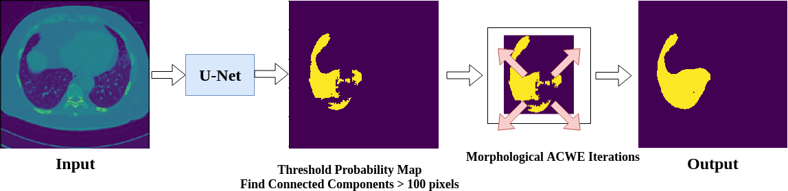
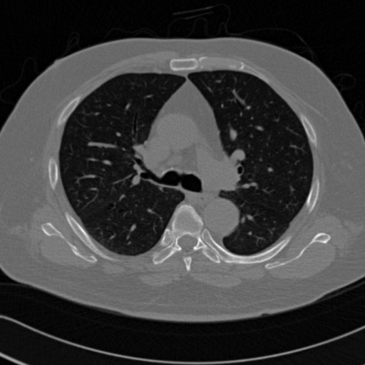

# CS269 2018 winter Deep MGAC

#### Dependent packages:
```
Tensorflow 1.4
scipy
matplotlib
```

#### Run demo
This demo will run the entire Deep MGAC pipeline with pretrained tensorflow model on one example input.

It will report the dice scores in the console and display segmentation output in the end.
```angular2html
python demo.py
```

#### Train FCN network
See `cfg/unet.cfg.json` as example of config file

See `archs/unet1.py` as example network definision

Run:
```angular2html
python train.py --cfg cfg/your_config.json
``` 




|Input|FCN Output| MGAC Segmentation Evolution| Ground Truth |
|-|-|-|-|
||| | 
